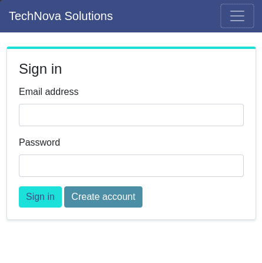
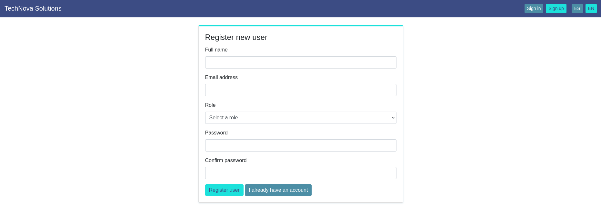
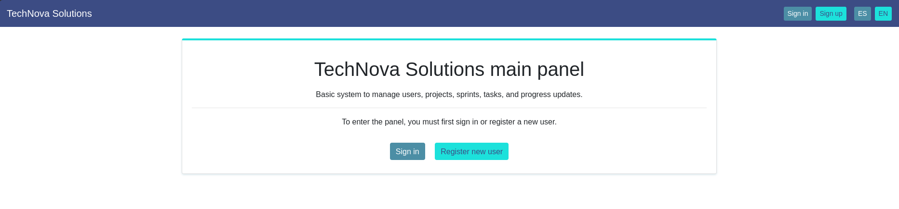

TECHNOVA SOLUTIONS

DESCRIPCIÓN

TechNova Solutions es una plataforma web de gestión de proyectos y tareas para empresas de desarrollo de software.

TechNova Solutions es una PYME de tecnología que desarrolla un producto de software orientado a la organización de flujos de trabajo para empresas de desarrollo de software y soporte técnico. El producto que TechNova Solutions construye es una aplicación web que sus clientes pueden usar para gestionar sus proyectos, equipos y tareas de forma centralizada.

El mercado objetivo son empresas que trabajan de manera simultánea en múltiples proyectos, cada uno con diferentes fases, equipos y plazos. Estas empresas enfrentan desafíos operativos comunes que el producto de TechNova Solutions viene a resolver.

JUSTIFICACIÓN

Ofrecer un producto de software de calidad que responda a la necesidad real de las empresas de organizar sus flujos de trabajo. La plataforma está pensada para equipos que manejan varios proyectos al mismo tiempo y necesitan una herramienta centralizada, accesible desde el navegador, sin instalaciones adicionales en cada computadora.

TechNova Solutions busca responder al siguiente problema:

En la actualidad, los equipos de desarrollo que utilizan correos electrónicos para comunicar cambios, notas en papel para tareas, hojas de cálculo descentralizadas para seguimiento y conversaciones informales que generan inconsistencias, están propensos a que esta dispersión de información les cause:

- Pérdida de documentación importante.
- Confusión sobre quién es responsable de cada tarea.
- Dificultad para saber el estado real de un proyecto.
- Duplicación de esfuerzos y comunicación ineficiente.
- Imposibilidad de auditar el trabajo completado.

La plataforma TechNova Solutions ofrece a sus usuarios las siguientes funcionalidades:

- Organizar proyectos: cada proyecto tiene un nombre, descripción, estado (activo, pausado, completado) y un responsable asignado.
- Planificar con sprints: los proyectos se dividen en ciclos de trabajo llamados sprints, cada uno con una fecha de inicio y fin clara.
- Administrar tareas: dentro de cada sprint, los equipos pueden crear tareas específicas con título, descripción y estado de progreso.
- Registrar avances: los miembros del equipo pueden documentar el trabajo realizado en cada sprint con descripción de actividades y horas trabajadas.
- Acceso seguro: cada usuario tiene su propia cuenta con credenciales, garantizando que solo personal autorizado acceda a la información.

La aplicación es accesible desde el navegador web, por lo que no requiere instalación en las computadoras de los miembros del equipo. Basta con conectarse a Internet, ingresar el usuario y contraseña, y tener acceso a toda la información del equipo de forma centralizada, ordenada y en tiempo real.

TechNova Solutions se presenta como una empresa de tecnología que identifica una necesidad concreta en el mercado del desarrollo de software:

- la falta de herramientas accesibles y simples para gestionar proyectos.

Herramientas como Jira o Asana existen en el mercado, pero su costo y complejidad las hacen poco accesibles para equipos pequeños. TechNova Solutions busca cubrir ese espacio con un producto propio, desarrollado con tecnología moderna, mantenible y escalable.

OBJETIVO GENERAL

Desarrollar una aplicación web funcional, permitiendo a sus usuarios gestionar proyectos, sprints, tareas y avances de forma centralizada.

OBJETIVOS ESPECÍFICOS

- Crear una estructura de proyecto funcional con la carpeta de proyectos, controladores y vistas organizadas correctamente.
- Definir rutas simples que permitan navegar a la página de inicio y al listado de proyectos (Pavón Puertas, J., 2014).
- Crear controladores que reciban las solicitudes del navegador y preparen los datos para las vistas (Rincón Cardona, J. J. (2025).
- Diseñar plantillas HTML que muestren la información de forma ordenada y atractiva (Pavón Puertas, J., 2014).
- Definir la estructura de las 5 tablas de la base de datos (López Quijado, J., 2014).
- Documentar el proyecto con explicaciones de cada entidad, tabla y decisión de diseño (Eslava Muñoz, V. J., 2018).

Este proyecto es importante por las siguientes razones:

- El usuario obtendrá una herramienta que mejora su productividad.
- El equipo ahorrará tiempo en comunicación y búsqueda de información.
- TechNova Solutions puede escalar la aplicación con nuevas funcionalidades en el futuro.

PRINCIPALES ENTIDADES DE PROGRAMACIÓN

- User: es un miembro del equipo que puede crear proyectos, modificarlos y ser responsable de ellos.
- Proyecto: Representa una lista de tareas organizadas para darle respuesta a la solicitud de un cliente o producto.
- Sprint: Representa un ciclo de trabajo compuesta generalmente por una o dos semanas.
- Tarea: Representa una tarea específica dentro del sprint.
- Avance: Representa el registro de trabajo en un sprint.

TABLAS DE LA BASE DE DATOS

Tabla: usuarios
Propósito: Almacenar los datos de los usuarios que usan la plataforma.

Tabla: proyectos
Propósito: Almacenar la información de los proyectos. Cada proyecto pertenece a un usuario responsable.

Tabla: sprints
Propósito: Dividir los proyectos en ciclos de trabajo. Organiza el trabajo en períodos definidos con fechas claras.

Tabla: tareas
Propósito: Desglosar el trabajo en tareas específicas. Permite seguimiento detallado del progreso dentro de cada sprint.

Tabla: avances
Propósito: Registrar el trabajo completado. Proporciona evidencia y seguimiento de las actividades realizadas.

RELACIÓN ENTRE TABLAS

- Un usuario puede iniciar y ser respondable de múltiples proyectos.
- Un proyecto puede contener múltiples spints.
- Un sprint puede contener múltiples tareas y múltiples registros de avance.

### Evidencias de Configuración

  

  

  

---

ENTORNO DE DESARROLLO Y HERRAMIENTAS UTILIZADAS

La instalación de todas las herramientas utilizadas en el presente curso de PHP intermedio se llevaron a cabo en el sistema operativo Arch Linux.

Se instalaron las siguientes herramientas:

En el enlace: https://www.apachefriends.org/es/index.html se descargó el servidor LAMPP, que equivale a XAMPP en entornos Linux (Nixon, R. (2019).

Se instalaron además, las herramientas Laravel, Composer, Artisan y Xdebug.

Tabla 1: Instalación exitosa de XAMPP en Linux.

Imagen 2: XAMPP para Linux con los servidores activos.

Imagen 3: Instalación exitosa de Xdebug en Linux.

DISEÑO VISUAL, COLORES E IMÁGENES

Se utilizará el recurso encontrado en este enlace: https://colorswall.com/es/palette/generate/o/49451 para asignar la paleta de colores del proyecto por componente.

Navegación:

- Fondo: Azul Oscuro Profundo (#3C4C84)
- Texto: Blanco (#FFFFFF)
- Logo: Turquesa Primario (#1CE1DB)
- Hover en enlaces: Turquesa Primario (#1CE1DB)

Botones Principales:

- Fondo: Turquesa Primario (#1CE1DB)
- Texto: Azul Oscuro Profundo (#3C4C84)
- Hover: Verde Azulado Oscuro (#1C797C)

Botones Secundarios:

- Fondo: Azul Grisáceo (#4C8EA5)
- Texto: Blanco (#FFFFFF)
- Hover: Verde Azulado Oscuro (#1C797C)

Tarjetas (Cards):

- Fondo: Blanco (#FFFFFF)
- Borde superior: 4px en Turquesa Primario (#1CE1DB)
- Sombra: sutil con Azul Grisáceo (#4C8EA5) en 0.2 opacidad

Tablas:

- Encabezado: Fondo Azul Oscuro Profundo (#3C4C84), texto blanco
- Filas alternas: Blanco y Púrpura/Lavanda Suave (#9EA4CC)
- Hover en fila: Azul Claro (#89C6F1)
- Bordes: Azul Grisáceo (#4C8EA5)

CONCLUSIONES

TechNova Solutions es una PYME de tecnología que desarrolla un producto de software para resolver un problema real del mercado: la falta de herramientas de bajo costo accesibles, para que equipos de desarrollo gestionen sus proyectos de forma centralizada. La plataforma permite a sus usuarios organizar proyectos, planificar sprints, administrar tareas y registrar avances desde el navegador, sin instalaciones adicionales.

En este primer avance se establece la base del producto, definiendo las principales entidades de programación, las tablas de la base de datos y la selección de la paleta de colores, imágenes y estilos a utilizar.

BIBLIOGRAFÍA

Eslava Muñoz, V. J. (2018). El nuevo PHP: conceptos avanzados: (1.ª ed.). Bubok Publishing S.L. https://elibro.net/es/ereader/ufidelitas/51353?page=12

Flórez Fernández, H., & Hernández Rodríguez, J. (2021). Aplicaciones web con PHP: (1.ª ed.). RA-MA Editorial. https://elibro.net/es/ereader/ufidelitas/230578?page=294

López Quijado, J. (2014). Domine PHP y MySQL: (2.ª ed.). RA-MA Editorial. https://elibro.net/es/ereader/ufidelitas/106410?page=32

Nixon, R. (2019). Aprender PHP, MySQL y JavaScript: (5.ª ed.). Marcombo. https://elibro.net/es/ereader/ufidelitas/280027?page=68

Pavón Puertas, J. (2014). Creación de un portal con PHP y MySQL: (4.ª ed.). RA-MA Editorial. https://elibro.net/es/ereader/ufidelitas/106413?page=36

Rincón Cardona, J. J. (2025). Aprenda desarrollo web con Laravel desde cero: (1.ª ed.). Marcombo. https://elibro.net/es/ereader/ufidelitas/281767?page=12
